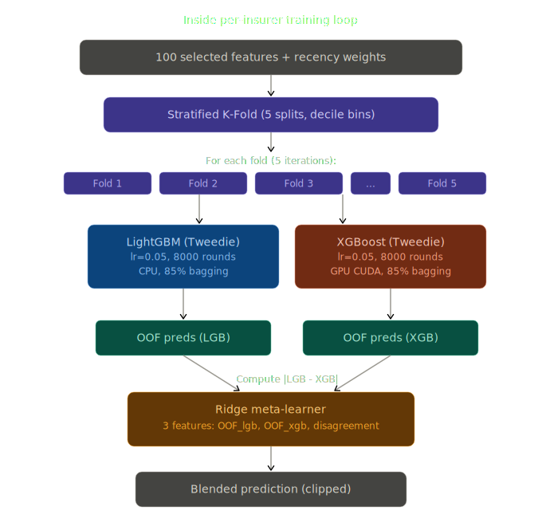

# Insurance Premium Prediction — Stacking Ensemble Pipeline

> **Note:** The `ensemble_EKI` directory contains the code used to train our best predictions so far. Additionally, we implemented a **recency bias** in our models to give more weight to more recent training data, ensuring our models adapt better to the temporal shift in the test blocks.

## Problem

Predict car insurance premiums for 11 insurers (A-K) given customer profiles (age, vehicle, location, coverage, deductible). Scored by **Pooled MAE** across all insurers and all valid quotes. Data is temporal: training = weeks 1-4, test block2 = week 5, test block3 = week 6.

## Architecture

### Pipeline Overview

<p align="center">
  
</p>

### Training Loop Detail

<p align="center">
  
</p>

Per-insurer models: each insurer gets its own independent pipeline (feature selection, training, meta-learner), since pricing strategies differ across insurers.

## Pipeline Stages

### 1. Feature Engineering

- **Date features**: contractor age, second driver age, years since registration, days since inspection, inspection days remaining — all derived from date columns relative to a reference date (2025-01-01)
- **Actuarial ratios**: claim-free years / age, power-to-weight ratio, vehicle value / age (depreciation proxy), deductible / vehicle value ratio
- **Interaction features**: claim-free x age, claim-free x vehicle age, coverage x age bucket composite
- **Deductible statistics**: mean/std/max/min across all insurers' deductibles, per-insurer deviation from mean
- **Frequency encoding**: rarity of postal code, municipality, vehicle maker/model (computed on train, applied to test to avoid distribution mismatch)
- **Crime/density**: high crime area flag (train-derived 75th percentile threshold), log address density

### 2. Geospatial Risk Zones

K-Means clustering (100 clusters) on postal code latitude/longitude. Creates a `risk_zone` categorical feature that captures geographic risk patterns. Fitted on training data, applied to test.

### 3. Recency Bias

Since test data is temporally after training data:
- **`quote_recency` feature**: normalized position in time (0-1 for training, 1.0 for block2, 1.2 for block3) — lets models learn temporal trends
- **Sample weights**: linear ramp from 0.5 (oldest rows) to 1.0 (newest rows). Recent training data has 2x influence on tree splits, biasing models toward patterns closer to the test period

### 4. Out-of-Fold Target Encoding

High-cardinality categoricals (postal code, municipality, province, vehicle maker/model, coverage x age bucket, risk zone) are target-encoded using OOF strategy with Bayesian smoothing (smoothing=20):
- Each training sample is encoded using statistics from OTHER folds only (no leakage)
- Test data is encoded using full training set statistics

### 5. Feature Selection

A quick CatBoost scout model (1200 iterations, GPU) is trained on the first fold split to rank features by importance. Top 100 features are kept. This reduces noise and speeds up training.

### 6. Stratified K-Fold Training (5 folds)

Targets are binned into deciles, then StratifiedKFold preserves the price distribution across folds.

For each fold:

**LightGBM (Tweedie)**
- Tweedie loss (variance_power=1.5) — actuarial standard for right-skewed premiums
- Learning rate 0.05, max 8000 rounds, early stopping at 300
- CPU (LightGBM GPU requires OpenCL which is unreliable on Colab)
- Receives recency sample weights

**XGBoost (Tweedie)**
- Same Tweedie loss, learning rate 0.05, max 8000 rounds
- GPU via CUDA (`tree_method='hist', device='cuda'`)
- Receives recency sample weights

Both models use 85% bagging per bag, label-encoded categoricals, and produce OOF predictions for the meta-learner.

### 7. Level-2 Meta-Learner

Ridge regression trained on:
- OOF predictions from LightGBM and XGBoost (2 features)
- Model disagreement signal: |LGB - XGB| (1 feature)

The meta-learner learns optimal blending weights that can vary by price range. Final predictions are clipped to minimum 1.0.

### 8. Submission Merge

Predictions are merged into existing submission CSVs by `quote_id` (not positional) to prevent row-order misalignment.

## Checkpointing

After each insurer completes, predictions and the completed-insurer list are saved to Google Drive. If the Colab runtime disconnects, re-running the script automatically skips completed insurers and resumes from the next one.

## Project Structure

Our repository contains several key directories and scripts used throughout our experimentation pipeline:

| Directory/File | Purpose |
|----------------|---------|
| `ensemble_EKI/` | **Code used to train our best predictions so far.** Contains scripts (`train.py`, `predict_one.py`, `merge_submissions.py`, etc.) for our top-performing stacking ensemble across all insurers. |
| `src/` | General source code and modularized components (`preprocess.py`, `train.py`, `format_submission.py`) used in earlier tests. |
| `models/` & `new_models/` | Saved models (e.g., `.cbm` CatBoost models) for individual insurers, including ensemble components. |
| `test_dis/` | Scripts like `check_bias.py` used to test and validate whether our predictions suffer from systemic biases across different demographics or features. |
| `testing_universability/` | Code for testing model generalization and generating cross-insurers evaluation matrices (`cross_mae_matrix.csv`). |
| `submissions/` | Output directory containing formatted submission files (`submission_block2.csv`, `submission_block3.csv`, etc.). |
| `data/` | Data assets (CSV/Parquet) for training and distinct data blocks (`block1_train`, `block2_test`, `block3_test`). |
| `eval_ensemble.py` & `predict_combined.py` | Standalone operational scripts to quickly evaluate models and combine our stacked methodologies. |
| `colab_notebook.py` | Main pipeline script — suitable to be run on Colab with GPU for heavy lifting. |

## How to Run

1. Create `matf_data/` folder in Google Drive root
2. Upload `data/` (3 parquet files) and `submissions/` (block2/block3 CSVs)
3. Upload `colab_notebook.py`
4. In Colab (A100/H100 GPU runtime):
```python
!pip install catboost lightgbm xgboost scikit-learn
%run /content/drive/MyDrive/matf_data/colab_notebook.py
```

## Key Design Decisions

- **Tweedie loss over MAE loss**: While the competition metric is MAE, Tweedie (p=1.5) models the right-skewed premium distribution better. The meta-learner then optimizes the blend for MAE.
- **No CatBoost in final ensemble**: CatBoost's MAE/Tweedie eval metrics are broken on GPU (silent fallback to different metric causes premature early stopping at ~170 iterations). Dropped in favor of reliable LGB + XGB.
- **LightGBM on CPU**: LightGBM GPU requires OpenCL, not available on most Colab instances. CPU LightGBM is fast enough.
- **Ridge meta-learner over complex stacker**: With only 2 base models, a simple linear blender avoids overfitting. The disagreement feature gives it mild nonlinear capacity.
- **Recency weighting**: Test data is 1-2 weeks after training. Linear weight ramp ensures the model prioritizes recent pricing patterns without discarding older data entirely.
